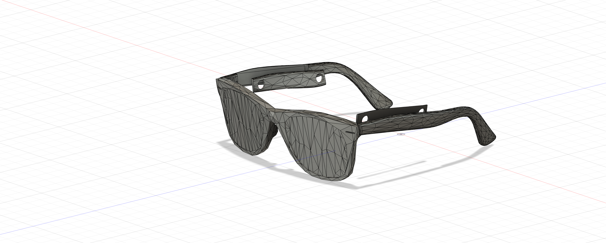
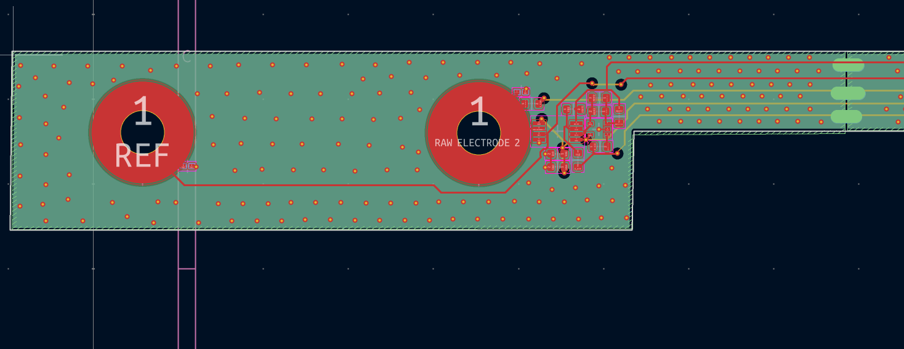
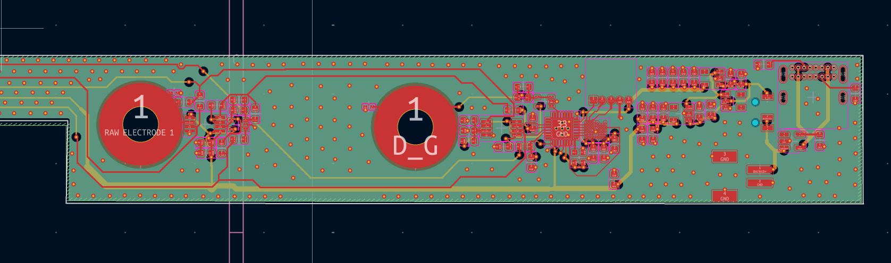
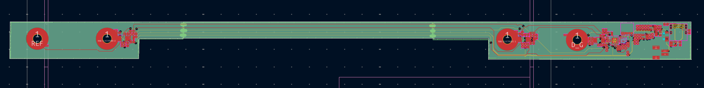

# EEG-glasses

## PCB

EEG Glasses is an early-stage research project developing wearable EEG glasses to address the lack of high-quality, real-world, naturalistic, multimodal neural data. The system is designed exclusively for clean, reliable signal acquisition in unconstrained environments, emphasizing electrode stability, low-noise amplification, and signal protection. It is in active prototyping and experimentation and is not intended for wellness or consumer use.

The long-term goal is a sleek, unobtrusive sensing platform that makes neural data collection a normal, everyday tool for scalable real-world BCI and cognitive neuroscience research.
